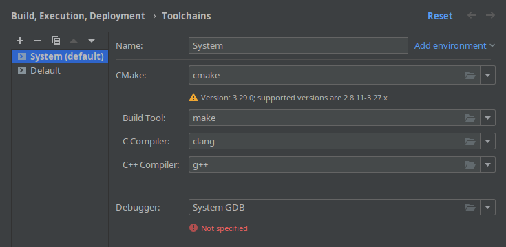

# IceFlow Nix Development Environment Guide
Nix is a declarative package manager that allows for easily reproducible development environments created from a
description file written in the Nix programming language.
For more detailed information regarding Nix, see https://nixos.org/.

This document provides documentation regarding the use of Nix for IceFlow development, as well as instructions on 
how to change or update dependencies and some explanations regarding the configuration file.

## Using Nix for IceFlow development
IceFlow provides a Nix Flake, which provides a development environment using the Nix-based tool 
[devenv.sh](https://devenv.sh).

In order to compile IceFlow in the Nix environment, you may follow the 
[Nix section of the installation instructions](../Install.md#using-nix-and-devenvsh).

By default, the development shell will include debug symbols for all dependencies except OpenCV.
If you need debug symbols for OpenCV too, you can enter a shell with debug symbols for OpenCV using:
```sh
nix develop --impure '.#debugAll'
```
Note, however, that this will compile OpenCV on your local system, which might take a while and a considerable amount
of resources.

Some IDEs may allow for direct integration with devenv.sh, see 
[the devenv.sh documentation](https://devenv.sh/getting-started/), most notably the section on "Editor Support".
For VSCode, refer to https://devenv.sh/editor-support/vscode/.
If you are using JetBrains IDEs (CLion), refer to the following section.

### Using the Nix environment in CLion
A plugin for adding syntax highlighting and linting to .nix files can be found [here](https://github.com/NixOS/nix-idea).

Unfortunately, CLion does not have direct support for Nix integration (i.e. automatically enabling a Nix environment 
configured for a project and using its compiler, libraries and debugger), even though this feature has been requested 
both for [the IDE itself](https://intellij-support.jetbrains.com/hc/en-us/community/posts/360008227939-How-to-configure-a-Nix-based-remote-interpreter)
as well as for [the nix-idea plugin](https://github.com/NixOS/nix-idea/issues/1).

So far, the easiest way to use Nix in CLion is by simply starting it from the command line while inside the Nix 
development shell.
This allows you to configure a toolchain in CLion that uses the Nix environment by simply specifying the command names 
without an absolute path:



## Changing the Nix environment

### Updating dependencies

For updates from the Nix package repositories:
`nix flake update` (will update flake.lock)

For updating packages that are defined in the `flake.nix` file itself:
1. Update the `src` attribute of the package in the `flake.nix` file as follows:
    - Update the `rev` to the git revision (commit hash or tag) you want to switch to.
    - Change a single character of the `hash` attribute (otherwise Nix will think that it doesn't have to redownload)
2. Save and close the file and reload the Nix environment (will happen automatically when using direnv). 
    This *will* fail, as the downloaded hash doesn't match, but the error message will provide you with the correct 
    hash of the downloaded new revision.
3. Update the `hash` attribute of the package again, this time using the hash given in the error message.
4. Save and close the file again. This time, the build should succeed (assuming there are no actualy compilation issues).

### Defining a dependency
Most basic dependencies are already available in the nixpkgs repository.
Therefore, the first step to adding a dependency should be to check for its presence in the [Nix repositories](https://search.nixos.org/packages).
Depending on whether the dependency is already available in the repositories, you can then refer to one of the following sections to add it.

#### Defining a dependency available in the repositories
To add a dependency that is already available in the repositories, simply add it to the packages attribute in the `devShell` defined in the `flake.nix` file.

#### Defining a dependency not available in the repositories
If a dependency is not available in the repositories, you need to define a package yourself.
The easiest way of doing so is by adding the package to the `pkg-overlay` set defined in the `flake.nix`.
Package definition differs based on the type of package and build system.

However, the basic steps for adding a package to the flake's `pkg-overlay`:
1. Create a derivation using `pkgs.stdenv.mkDerivation`
2. Define the package source (typically using `pkgs.fetchFromGitHub` or `pkgs.fetchgit`), which involves specifying the git revision and hash of the downloaded source (see [Updating dependencies](#updating-dependencies)).
3. Add the build system to `nativeBuildInputs` and the dependencies as `buildInputs` (if necessary).
4. Set build system-specific configuration options
5. Add the name of the created derivation to the `iceflowDependencies` variable defined in `flake.nix`, which will add it both to the developer shell and to the package build.

For CMake based projects, you may specify additional flags using the `cmakeFlags` attribute inside of the derivation.
You can use other package definitions already present in the `flake.nix` as templates (e.g. `ndn-svs` for WAF-based packages).

For other build systems and more information regarding build system specific configuration, refer to the Nix documentation regarding [build hooks](https://nixos.org/manual/nixpkgs/stable/#chap-hooks).

Some general information regarding C-based projects can also be found in the [NixOS Wiki](https://nixos.wiki/wiki/C).

For more information regarding package definitions in general, refer to the Nix documentation regarding the [Standard environment](https://nixos.org/manual/nixpkgs/stable/#part-stdenv)

### Overriding packages (e.g. change versions)
Overriding packages can be done by adding an attribute to the `pkg-overlay` defined in the `flake.nix`.
To do so, you can use the `overrideAttrs` function of the package whose version you would like to change.

For instance, this pkg-overlay will override the `ndn-cxx` package version with a specific commit:
```nix
let pkg-overlay = (final: prev: rec {
    ndn-cxx = prev.ndn-cxx.overrideAttrs (old: rec {
      src = prev.fetchFromGitHub {
        owner = "named-data";
        repo = "ndn-cxx";
        rev = "18ccbb3b1f600d913dd42dd5c462afdac77e37e0";
        hash = "sha256-yHsp6dBq2kMsubJrn77qeQ9Ah+Udy7nE9eWBX2smemA="; 
        fetchSubmodules = true; 
      };
    
    });
});
in {}
```
For instructions on how to get the right hash, see [Updating dependencies](#updating-dependencies).
You may also override any other attribute of the derivation, which allows for customization of build flags, etc.
For more information on these customizations, you may refer to the documentation linked in [Defining a dependency not available in the repositories](#defining-a-dependency-not-available-in-the-repositories).

### Adding command line tools
In general, it should be sufficient to add the tools to the default `devShell`'s `packages` attribute, assuming that it is present in the Nix package repository.
If a package is not available there, refer to [Defining a dependency not available in the repositories](#defining-a-dependency-not-available-in-the-repositories)
